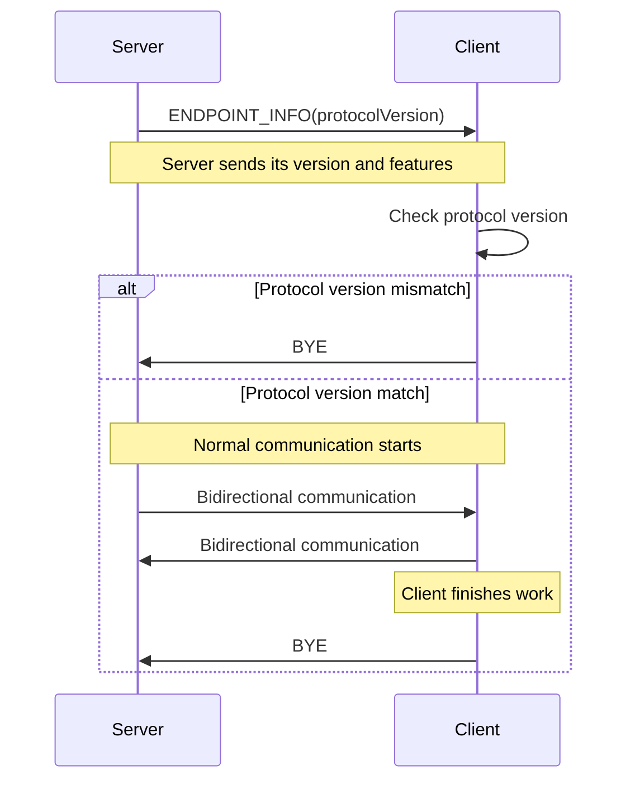

# Introduction

Cryo is a small binary protocol for sending arbitrary messages, large data and real-time information over WebSocket.
It uses fixed frame types for acknowledgements, heartbeats, UTF-8 text, binary payloads and streamed transactions.

# Design Goals

A lot of WebSocket libraries and frameworks introduce their own abstractions such as

- rooms
- namespaces
- events
- channels
- RPC systems

While useful and a pleasure to work with, these abstractions also shape how applications are designed.

Cryo intentionally does **not** do this.

Instead, Cryo provides a handful of simple building blocks:

- UTF-8 messages
- binary messages
- acknowledgements
- heartbeats
- streamed transactions + flow control

Applications are expected to build their own higher-level behavior on top of these primitives.

Cryo aims to stay relatively **small** and **understandable**.
It is not trying to be an extremely advanced protocol, nor does it attempt to replace existing networking standards.
The focus is **practicality** and **flexibility**.

Another important goal is efficient handling of large data transfers.
Transactions allow binary data to be **streamed incrementally** instead of requiring large payloads to be buffered
entirely in memory.

In general, Cryo prefers explicit protocol behavior over framework magic.
The protocol should remain easy to inspect, easy to implement, and easy to adapt to different kinds of applications.

# Transport

Cryo uses the `WebSocket` protocol as its transport layer, which directly implies ordered delivery of messages as
`WebSocket` is built upon `TCP`.

As such, there is no dependency on application-level sequence numbers to detect potentially lost or partial
transmissions.

# Authentication

During the **HTTP-Upgrade**, the receiving Cryo server looks for a query parameter `authorization`.

Authorization in this scenario is a bearer token in the shape of `Bearer <some auth token>`.

The Cryo server then executes a user-defined function with the value of the `authorization` query parameter.
If it returns `true`, the **HTTP-Upgrade** request is completed and the session is authenticated, if it returns `false`,
an **HTTP 401** status is returned.

# Identification

During the **HTTP-Upgrade**, the receiving Cryo-Server looks for a query parameter `x-cryo-sid`.
A Cryo session is identified by a **client-chosen SID** in an 8-byte **int64 ** format which is carried by each frame.

This **SID** is chosen randomly by the client. If a connection attempt is made, and the server already has a running
session with this **SID**, the new connection is rejected.

To coherently identify a Cryo session, either the bearer token in the `authorization` query parameter shall be used, or
a custom process must be implemented.

# Lifecycle



# Frame encoding

The entire Cryo protocol uses binary encoding. It can carry plaintext, but it is not a plaintext-only protocol.

**All** numeric values in Cryo are encoded using the `Big-Endian` format order.

# Frames

Cryo frames are organized into namespaces. Currently, two namespaces exist:

- Cryo.Base
- Cryo.Transaction

Following is a listing of all frames, an explanation per-frame and their binary layout.

### Cryo.Base

```
FrameType :=
    ENDPOINT_INFO = 255,
    BYE = 254,
    ACK = 253,
    ERROR = 252,
    PING_PONG = 251,
    UTF8DATA = 250,
    BINARYDATA = 249

CRYO_MAX_PAYLOAD :=
    16 * 1024 * 1024

ENDPOINT_INFO_FLAGS :=
    bit[0] = FEATURE_TRANSACTIONS,
    bit[1..64] = RESERVED,

- Sent immediately after connection establishment
- Announces protocol version and endpoint capabilities
EndpointInfoFrame := [
    sid:    int64                   / byte[8],
    type:   0xff                    / byte[1],
    ack:    uint32                  / byte[4],
    ver:    uint32                  / byte[4],
    flags:  ENDPOINT_INFO_FLAGS     / byte[8]
]

- Gracefully terminates a Cryo session
- May be acknowledged using ACKFrame
ByeFrame := [
    sid:    int64   / byte[8],
    type:   0xfe    / byte[1],
    ack:    uint32  / byte[4]
]

ACKs in Cryo are application-level receipt confirmations.

When a non-TX_CHUNK frame is sent, the sender assigns an incrementing ACK identifier and tracks it until an ACKFrame
is received from the remote endpoint.

ACKs are intentionally separate from transport-level reliability provided by TCP/WebSocket.
An ACKFrame simply confirms that a frame was received and accepted by the remote Cryo endpoint.

TX_CHUNK frames are excluded from explicit acknowledgements for performance reasons.
Transactions are instead acknowledged as a whole through TX_FINISH and higher-level application behavior.

- Application-level acknowledgement frame
- Confirms receipt of a previously tracked frame
ACKFrame := [
    sid:    int64   / byte[8],
    type:   0xfd    / byte[1],
    ack:    uint32  / byte[4]
]

- Protocol-level error frame
- Reserved for custom error handling
ErrorFrame := [
    sid:        int64   / byte[8],
    type:       0xfc    / byte[1],
    ack:        uint32  / byte[4],
    payload:    string  / byte[n..CRYO_MAX_PAYLOAD]
]

- Heartbeat keepalive frame
- "ping" must be answered with "pong" and vice-versa
PingPongFrame := [
    sid:        int64       / byte[8],
    type:       0xfb        / byte[1],
    ack:        uint32      / byte[4],
    payload:    ping | pong / byte[4]
]

- Carries arbitrary UTF-8 text data
Utf8DataFrame := [
    sid:        int64   / byte[8],
    type:       0xfa    / byte[1],
    ack:        uint32  / byte[4],
    payload:    string  / byte[n..CRYO_MAX_PAYLOAD]
]

- Carries arbitrary binary data
BinaryDataFrame := [
    sid:        int64   / byte[8],
    type:       0xf9    / byte[1],
    ack:        uint32  / byte[4],
    payload:    binary  / byte[n..CRYO_MAX_PAYLOAD]
]
```

### Cryo.Transaction

```
FrameType :=
    TX_START = 0x00,
    TX_CHUNK = 0x01,
    TX_FINISH = 0x02,
    TX_FLOW = 0x03,
    TX_FETCH = 0x04

FLOW_BEHAVIOUR :=
    TX_PUSH = 0x00,
    TX_PULL = 0x01

Transaction flow controls how explicit-length transactions are delivered.

By default, transactions use TX_PUSH. In TX_PUSH mode, the sender may transmit chunks continuously after TX_START.

TX_PULL exists for receivers that want application-level backpressure.
In TX_PULL mode, chunks are only sent after the receiver explicitly requests a range using TX_FETCH.
This allows receivers to pace large transfers, limit buffering, process data incrementally, and avoid accepting chunks faster than they can consume them.

- Starts a transaction
- Receiver allocates transaction state using txid
- Empty names must default to "anonymous"
- size >= 0 for explicit-length transactions
- size = -1 for streaming/unknown-length transactions
TXStartFrame = [
    sid:        int64   / byte[8],
    type:       0x00    / byte[1],
    ack:        uint32  / byte[4],
    txid:       uint32  / byte[4],
    size:       int32   / byte[4],
    name:       string  / byte[n..CRYO_MAX_PAYLOAD]
]

- Transaction payload chunk
- Receiver appends payload to transaction buffer
- seq identifies the chunk position within the transaction
TXChunkFrame = [
    sid:        int64   / byte[8],
    type:       0x01    / byte[1],
    txid:       uint32  / byte[4],
    seq:        uint32  / byte[4],
    payload:    binary  / byte[n..CRYO_MAX_PAYLOAD]
]

- Marks transaction completion
- Receiver resolves and finalizes transaction
TXFinishFrame = [
    sid:        int64   / byte[8],
    type:       0x02    / byte[1],
    ack:        uint32  / byte[4],
    txid:       uint32  / byte[4]
]

- Sets session transaction flow mode
- Defaults to TX_PUSH
- Must be sent before transaction start
- Only meaningful for explicit-length transactions
TXFlowFrame = [
    sid:        int64               / byte[8],
    type:       0x03                / byte[1],
    ack:        uint32              / byte[4],
    behaviour:  FLOW_BEHAVIOUR      / byte[1]
]

- Chunk range request for TX_PULL sessions
- Server sends chunks start..end, then waits for next request
- end beyond available chunk count transmits remaining chunks
- Only meaningful for explicit-length transactions
TXFetchFrame = [
    sid:        int64               / byte[8],
    type:       0x04                / byte[1],
    ack:        uint32              / byte[4],
    start:      uint32              / byte[4],
    end:        uint32              / byte[4]
]
```

# Error handling

Any Cryo endpoint may send an `error` frame.
As Cryo itself is not dependent on responses for each type of frame, there is no standardized way to handle errors for
each frame type.

As such, sending an error frame may not be useful during some implementations, but may be useful when an **RPC**-System
is built upon Cryo.

# Security

Cryo itself does not provide any further encryption.
It is recommended to only use Cryo in secure contexts (TLS, HTTPS, WSS).

# Versioning

Cryo versions correspond to releases of the NPM
package [cryo-protocol](https://www.npmjs.com/package/cryo-protocol "cryo-protocol on NPM").

# Implementations

- [Cryo-Server in TypeScript under Node.Js](https://github.com/Ranchonyx/Cryo-Server)
- [Cryo client library in TypeScript under modern browsers](https://github.com/Ranchonyx/Cryo-Client-Browser)
- [Cryo client library in TypeScript under Node.Js](https://github.com/Ranchonyx/Cryo-Client-Node)