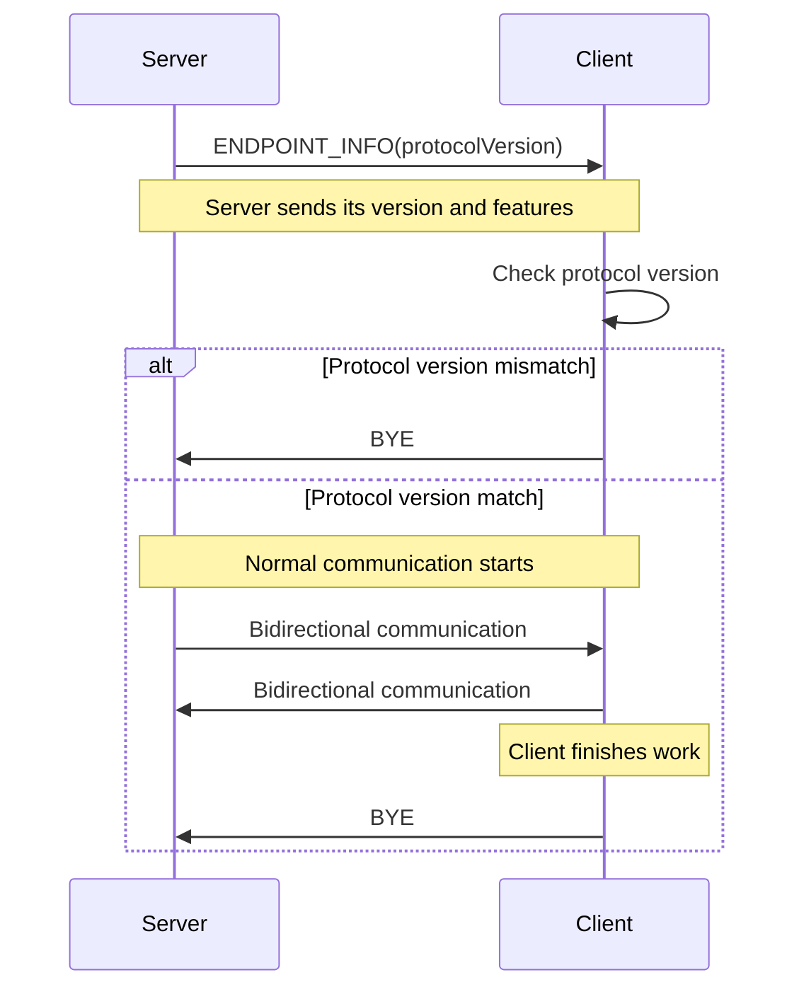
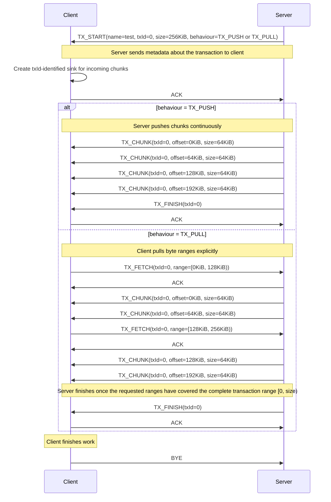

# Introduction

The Cryo Application Messaging Protocol (CAMP) is a lightweight WebSocket subprotocol for application messaging, binary
payload exchange, acknowledgements, and flow-controlled transactions.

# Design Goals

A lot of WebSocket libraries and frameworks introduce their own abstractions such as

- rooms
- namespaces
- events
- channels
- RPC systems

While useful and a pleasure to work with, these abstractions also shape how applications are designed.

CAMP intentionally does **not** do this.

Instead, CAMP provides a handful of simple building blocks:

- UTF-8 messages
- binary messages
- acknowledgements
- heartbeats
- streamed transactions + flow control

Applications are expected to build their own higher-level behavior on top of these primitives.

CAMP aims to stay relatively **small** and **understandable**.
It is not trying to be an extremely advanced protocol, nor does it attempt to replace existing networking standards.
The focus is **practicality** and **flexibility**.

Another important goal is efficient handling of large data transfers.
Transactions allow binary data to be **streamed incrementally** instead of requiring large payloads to be buffered
entirely in memory.

In general, CAMP prefers explicit protocol behavior over framework magic.
The protocol should remain easy to inspect, easy to implement, and easy to adapt to different kinds of applications.

# Transport

CAMP uses the `WebSocket` protocol as its transport layer, which directly implies ordered delivery of messages as
`WebSocket` is built upon `TCP`.

As such, there is no dependency on application-level sequence numbers to detect potentially lost or partial
transmissions.

## WebSocket Negotiation

CAMP endpoints negotiate the protocol using the `Sec-WebSocket-Protocol` header.

The registered WebSocket subprotocol identifier for CAMP is `camp`.

Clients request CAMP by including `camp` in `Sec-WebSocket-Protocol`.
Servers accepting CAMP respond with `Sec-WebSocket-Protocol: camp`.

# Authentication

During the **HTTP-Upgrade**, the receiving CAMP server looks for a query parameter `authorization`.

Authorization in this scenario is a bearer token in the shape of `Bearer <some auth token>`.
> Bearer tokens in query parameters may be exposed through logs, browser history, or proxy diagnostics.
>
> Deployments should prefer short-lived upgrade tokens or another authentication mechanism where possible.

The CAMP server then executes a user-defined function with the value of the `authorization` query parameter.
If it returns `true`, the **HTTP-Upgrade** request is completed and the session is authenticated, if it returns `false`,
an **HTTP 401** status is returned.

# Identification

During the **HTTP-Upgrade**, the receiving CAMP-Server looks for a query parameter `x-camp-sid`.
A CAMP session is identified by a **client-chosen SID** in an 8-byte **uint64** format which is carried by each frame.

This **SID** is chosen randomly by the client. If a connection attempt is made, and the server already has a running
session with this **SID**, the new connection is rejected.

To coherently identify a CAMP session, either the bearer token in the `authorization` query parameter shall be used, or
a custom process must be implemented.

# Lifecycle



# Frame encoding

The entire CAMP protocol uses binary encoding. It can carry plaintext, but it is not a plaintext-only protocol.

**All** numeric values in CAMP are encoded using the `Big-Endian` format order.

**All** string values in CAMP are encoded as UTF-8.

# Frames

A CAMP frame must be transmitted as exactly one WebSocket message.
Multiple CAMP frames must not be coalesced into one WebSocket message, and one CAMP frame must not be split across
multiple WebSocket messages.

CAMP frames are organized into namespaces. Currently, two namespaces exist:

- CAMP.Base
- CAMP.Transaction

Following is a listing of all frames, an explanation per-frame and their binary layout.

### CAMP.Base

```
FrameType :=
    ENDPOINT_INFO = 255,
    BYE = 254,
    ACK = 253,
    ERROR = 252,
    PING_PONG = 251,
    UTF8DATA = 250,
    BINARYDATA = 249

CAMP_MAX_PAYLOAD :=
    1 * 1024 * 1024

CAMP_MAX_NAME :=
    1 * 1024

ENDPOINT_INFO_FLAGS :=
    bit[0] = FEATURE_TRANSACTIONS,
    bit[1..63] = RESERVED,

PING_PAYLOAD :=
    "ping" encoded as UTF-8 / byte[4]

PONG_PAYLOAD :=
    "pong" encoded as UTF-8 / byte[4]

- Sent immediately after connection establishment
- Announces the endpoint protocol version
- Announces endpoint capabilities using feature flags
EndpointInfoFrame := [
    sid:    uint64                  / byte[8],
    type:   0xff                    / byte[1],
    ack:    uint32                  / byte[4],
    ver:    uint32                  / byte[4],
    flags:  ENDPOINT_INFO_FLAGS     / byte[8]
]

- Gracefully terminates a CAMP session
- May be acknowledged using ACKFrame
ByeFrame := [
    sid:    uint64  / byte[8],
    type:   0xfe    / byte[1],
    ack:    uint32  / byte[4]
]

ACKs in CAMP are application-level receipt confirmations.

When an ACK-tracked frame is sent, the sender assigns an incrementing ACK identifier and tracks it until an ACKFrame is received from the remote endpoint.

ACKs are intentionally separate from transport-level reliability provided by TCP/WebSocket.
An ACKFrame confirms that a frame was received and accepted by the remote CAMP endpoint.

For all ACK-tracked frames, the ack field contains the sender-assigned acknowledgement identifier.
For ACKFrame, the ackedAck field contains the ack value of the frame being acknowledged.

ACK, PING_PONG and TX_CHUNK frames are not ACK-tracked.

TX_CHUNK frames are excluded from explicit acknowledgements for performance reasons.
Transaction completion is signalled using TX_FINISH.
The ACK for TX_FINISH confirms that the finish frame was received and accepted, not that higher-level application processing succeeded.

- Application-level acknowledgement frame
- Confirms receipt and acceptance of a previously tracked frame
- ackedAck contains the ack value of the frame being acknowledged
ACKFrame := [
    sid:        uint64  / byte[8],
    type:       0xfd    / byte[1],
    ackedAck:   uint32  / byte[4]
]

- Application-level error frame
- Carries a UTF-8 diagnostic message
- Does not define machine-readable error semantics
ErrorFrame := [
    sid:        uint64  / byte[8],
    type:       0xfc    / byte[1],
    ack:        uint32  / byte[4],
    payload:    string  / byte[n..CAMP_MAX_PAYLOAD]
]

- Heartbeat keepalive frame
- Carries either PING_PAYLOAD or PONG_PAYLOAD
- When an endpoint receives PING_PAYLOAD, it must respond with PONG_PAYLOAD
- When an endpoint receives PONG_PAYLOAD, it must not respond with another PingPongFrame
PingPongFrame := [
    sid:        uint64                      / byte[8],
    type:       0xfb                        / byte[1],
    payload:    PING_PAYLOAD | PONG_PAYLOAD / byte[4]
]

- Carries arbitrary UTF-8 text data
- Payload must not exceed CAMP_MAX_PAYLOAD
Utf8DataFrame := [
    sid:        uint64  / byte[8],
    type:       0xfa    / byte[1],
    ack:        uint32  / byte[4],
    payload:    string  / byte[n..CAMP_MAX_PAYLOAD]
]

- Carries arbitrary binary data
- Payload must not exceed CAMP_MAX_PAYLOAD
BinaryDataFrame := [
    sid:        uint64  / byte[8],
    type:       0xf9    / byte[1],
    ack:        uint32  / byte[4],
    payload:    binary  / byte[n..CAMP_MAX_PAYLOAD]
]
```

### CAMP.Transaction

### Transaction lifecycle



```
FrameType :=
    TX_START = 0x00,
    TX_CHUNK = 0x01,
    TX_FINISH = 0x02,
    TX_FETCH = 0x03,
    TX_CANCEL = 0x04

FLOW_BEHAVIOUR :=
    TX_PUSH = 0x00,
    TX_PULL = 0x01

Transaction flow controls how explicit-length transactions are delivered.

By default, transactions use TX_PUSH. In TX_PUSH mode, the sender may transmit chunks continuously after TX_START.

TX_PULL exists for receivers that want application-level backpressure.
In TX_PULL mode, transaction payload bytes are only sent after the receiver explicitly requests a byte range using TX_FETCH.
This allows receivers to pace large transfers, limit buffering, process data incrementally, and avoid accepting chunks faster than they can consume them.

- Starts a transaction
- Receiver allocates transaction state using txId
- Empty names must default to "anonymous"
- size >= 0 identifies an explicit-length transaction
- size = -1 identifies a streaming/unknown-length transaction
- TX_PULL is only valid for explicit-length transactions
- If size = -1, behaviour must be TX_PUSH
TXStartFrame = [
    sid:        uint64          / byte[8],
    type:       0x00            / byte[1],
    ack:        uint32          / byte[4],
    txId:       uint32          / byte[4],
    size:       int64           / byte[8],
    behaviour:  FLOW_BEHAVIOUR  / byte[1],
    name:       string          / byte[n..CAMP_MAX_NAME]
]


- Transaction payload chunk
- Carries transaction bytes for the transaction identified by txId
- offset identifies the payload's starting position within the transaction
- payload represents bytes [offset, offset + payload.length)
- Receiver places payload at the given byte offset within the transaction
- Payload must not exceed CAMP_MAX_PAYLOAD
TXChunkFrame = [
    sid:        uint64  / byte[8],
    type:       0x01    / byte[1],
    txId:       uint32  / byte[4],
    offset:     uint64  / byte[8],
    payload:    binary  / byte[n..CAMP_MAX_PAYLOAD]
]


- Marks transaction completion
- Receiver resolves and finalizes transaction state
- The ACK for TX_FINISH confirms receipt of the finish frame, not higher-level processing success
TXFinishFrame = [
    sid:        uint64  / byte[8],
    type:       0x02    / byte[1],
    ack:        uint32  / byte[4],
    txId:       uint32  / byte[4]
]


- Byte range request for TX_PULL sessions
- Only meaningful for explicit-length transactions
- Requests bytes in the half-open range [start, end)
- The byte at start is included; the byte at end is excluded
- start must be less than end
- start must be less than the transaction size
- end beyond available byte count transmits remaining bytes
TXFetchFrame = [
    sid:        uint64  / byte[8],
    type:       0x03    / byte[1],
    ack:        uint32  / byte[4],
    txId:       uint32  / byte[4],
    start:      uint64  / byte[8],
    end:        uint64  / byte[8]
]

A sender may satisfy a single TX_FETCH using one or more TX_CHUNK frames.
Each TX_CHUNK payload must not exceed CAMP_MAX_PAYLOAD.
In TX_PULL mode, TX_CHUNK frames sent in response to TX_FETCH must be contained within the requested byte range.


- Cancels a running transaction
- Signals the sender to stop sending transaction data
- Sender removes the transaction from its store
TXCancelFrame = [
    sid:        uint64  / byte[8],
    type:       0x04    / byte[1],
    ack:        uint32  / byte[4],
    txId:       uint32  / byte[4]
]
```

# Error handling

Any CAMP endpoint may send an `ERROR` frame.

`ERROR` carries a UTF-8 diagnostic message. CAMP does not define machine-readable error codes or per-frame error
semantics. Applications built on top of CAMP may define their own error payload format if they require structured error
handling.

Because CAMP itself is not request/response based for every frame type, receiving an `ERROR` frame does not
automatically imply that a specific previous frame failed unless the application protocol defines such a relationship.

# Security

CAMP itself does not provide any further encryption.
It is recommended to only use CAMP in secure contexts (TLS, HTTPS, WSS).

# Versioning

Protocol versions are communicated through the field 'ver' in an ENDPOINT_INFO frame.

Implementations must reject incompatible protocol versions.

The version numbering scheme is implementation-defined.

# Implementations

- [CAMP-Server in TypeScript under Node.Js](https://github.com/Ranchonyx/Cryo-Server)
- [CAMP client library in TypeScript under modern browsers](https://github.com/Ranchonyx/Cryo-Client-Browser)
- [CAMP client library in TypeScript under Node.Js](https://github.com/Ranchonyx/Cryo-Client-Node)

# IANA Considerations

This document requests registration of the following WebSocket subprotocol name in the IANA WebSocket Subprotocol Name
Registry.
Subprotocol Identifier: camp
Subprotocol Common Name: Cryo Application Messaging Protocol (CAMP)
Subprotocol Definition: This document